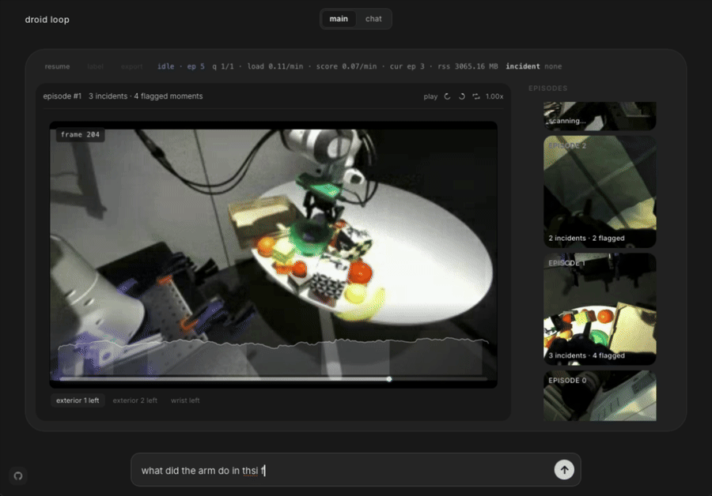

# DROID Loop

Live demo: [droid-loop.dunkeln.com](https://droid-loop.dunkeln.com)

DROID Loop mines multiview robot manipulation video for rare failures, turns them into reviewable incidents, and exports validated signal for a data flywheel.



## What It Does
- scans DROID episodes asynchronously and scores frames with SigLIP-based anomaly mining
- merges flagged frames into incident windows and persists results in `catalog.db`
- restores episodes with retained review media from `frames/`
- supports multiview review, inline VLM-assisted analysis, and approve/reject feedback

## Run Locally
```bash
uv sync
uv run uvicorn server:app --host 127.0.0.1 --port 8000
cd ui && npm install && npm run dev
```
